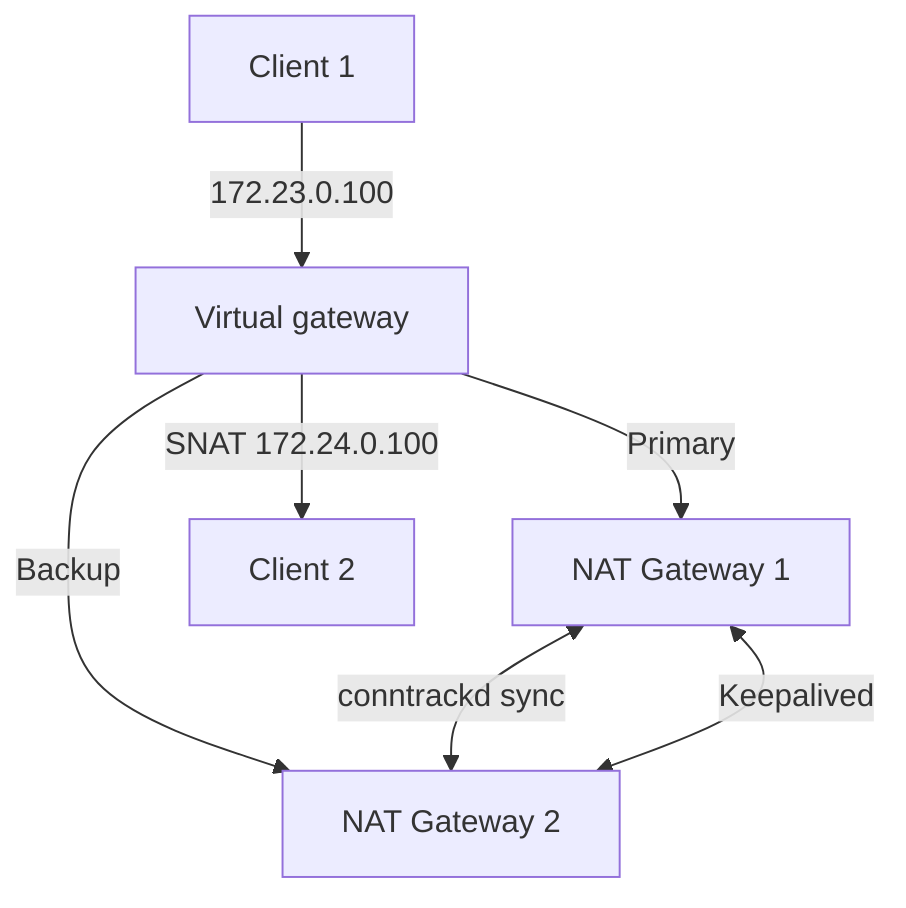

# Conntrackd NAT Gateway Example

This project demonstrates how to set up redundant NAT gateways using [conntrackd](https://manpages.debian.org/testing/conntrackd/conntrackd.8.en.html) and [keepalived](https://keepalived.org/) for stateful failover of network connections. It uses Vagrant and Docker to create a test environment with two NAT gateways and two client machines on separate networks.

## Project Structure

- **natgateway/**: Contains configuration files and scripts for NAT gateway containers.
- **Dockerfile.client**: Dockerfile for client containers.
- **Vagrantfile**: Defines the topology and provisioning for the test environment.
- **.vagrant/**: Vagrant state directory.

## Topology

- **nat1**: NAT gateway on `net1` (172.23.0.10) and `net2` (172.24.0.10)
- **nat2**: Redundant NAT gateway on `net1` (172.23.0.11) and `net2` (172.24.0.11)
- **client1**: Host on `net1` (172.23.0.20)
- **client2**: Host on `net2` (172.24.0.20)



## Features

- **Stateful NAT failover**: conntrackd synchronizes connection tracking state between gateways.
- **VRRP failover**: keepalived manages VIPs and failover between gateways.
- **Health checks and notifications**: Scripts handle state transitions and log events.

## Usage

### Prerequisites

- [Vagrant](https://www.vagrantup.com/) (with Docker provider)
- [Docker](https://www.docker.com/)

### Start the Example

1. **Clone the repository** and enter the directory:
    ```sh
    git clone <repo-url>
    cd conntracd-test
    ```

2. **Start the environment**:
    ```sh
    vagrant up --parallel
    ```

3. **Check status**:
    ```sh
    vagrant status
    vagrant docker-logs
    ```

4. **Access containers**:
    ```sh
    docker exec -it $(docker ps -q -f name=nat1) /bin/bash
    docker exec -it $(docker ps -q -f name=nat2) /bin/bash
    docker exec -it $(docker ps -q -f name=client1) /bin/bash
    docker exec -it $(docker ps -q -f name=client2) /bin/bash
    ```

### Testing Failover

- Simulate failover by stopping `nat1` or `nat2` and observe VIP migration and state sync.
- Use `ping`, `tcpdump`, or other tools inside clients to test connectivity.

#### SSH Connectivity Test

This test demonstrates that `client1` can connect to `client2` via the NAT gateway and maintain the SSH session even if the primary NAT gateway fails.

1. **Prepare SSH Access on `client2`:**
    ```sh
    docker exec -it $(docker ps -q -f name=client2) /bin/bash
    # The 'test' user is created in Dockerfile.client
    passwd test
    exit
    ```

2. **Configure Routing:**
    ```sh
    # On client1, route traffic to net2 via the NAT gateway
    docker exec -it $(docker ps -q -f name=client1) ip route add 172.24.0.0/16 via 172.23.0.100

    # On client2, route traffic to net1 via the NAT gateway
    docker exec -it $(docker ps -q -f name=client2) ip route add 172.23.0.0/16 via 172.24.0.100
    ```

3. **Monitor SSH Traffic on `nat2`:**
    ```sh
    # Run in a separate terminal to observe failover
    docker exec -it $(docker ps -q -f name=nat2) tcpdump -i eth1 dst port 22 -n
    ```

4. **Establish SSH Connection:**
    ```sh
    docker exec -it $(docker ps -q -f name=client1) ssh test@172.24.0.20
    ```

5. **Simulate Failover:**
    ```sh
    # Stop nat1 to trigger failover
    docker stop $(docker ps -q -f name=nat1)
    # The SSH session should remain active, now routed through nat2
    ```

6. **Restore Primary NAT Gateway:**
    ```sh
    docker start $(docker ps -q -f name=nat1)
    # Remove lock file to allow nat1 to reclaim the VIP
    docker exec -it $(docker ps -q -f name=nat1) rm /var/run/conntrackd.lock
    # SSH traffic should switch back to nat1; session remains active
    ```

7. **Optional: Test Further Failover**
    ```sh
    # Stop nat2 to confirm SSH session persists through nat1
    docker stop $(docker ps -q -f name=nat2)
    ```

**Tip:** Use `tcpdump` to observe traffic flow and verify seamless failover between gateways.
### Cleanup

```sh
vagrant destroy --parallel
```